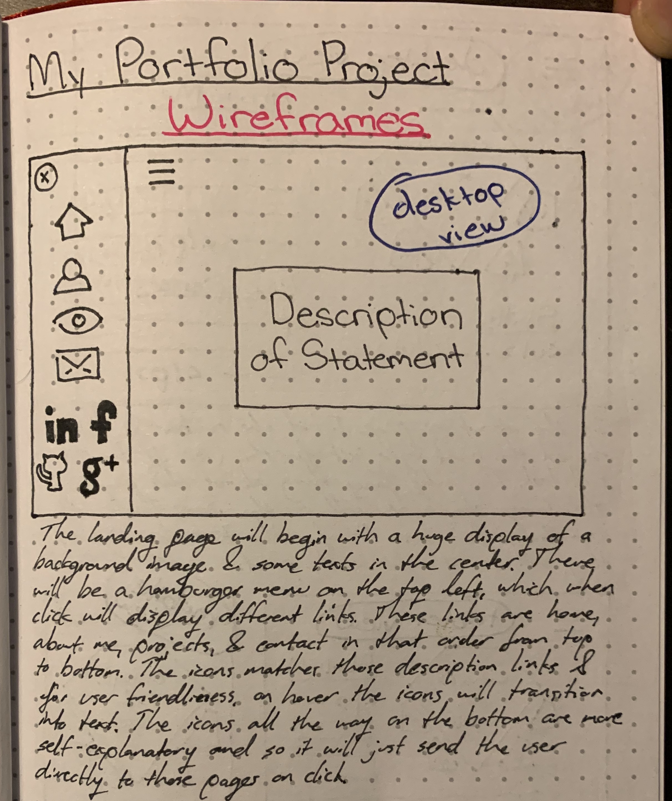
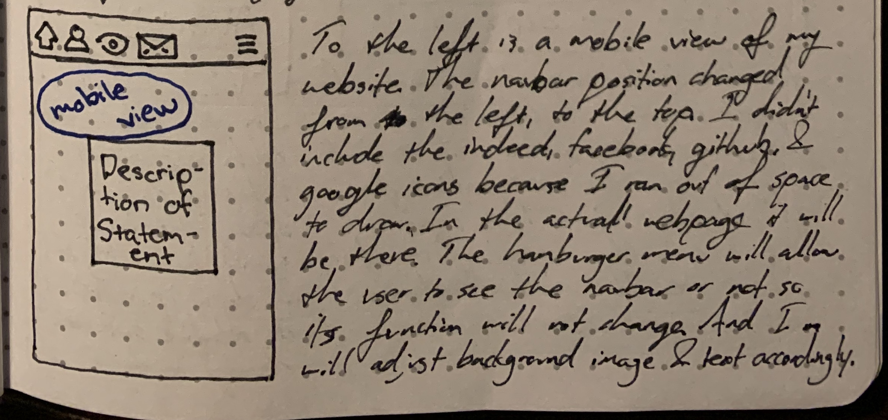
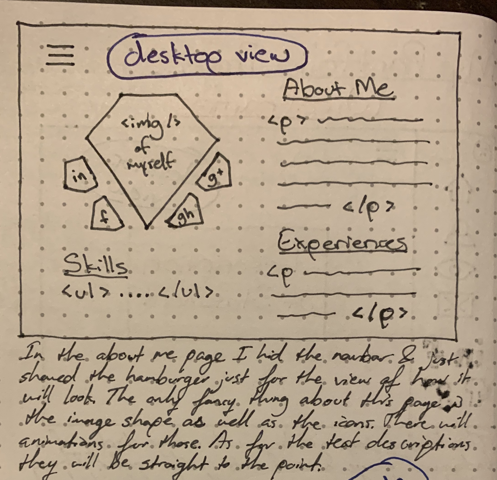
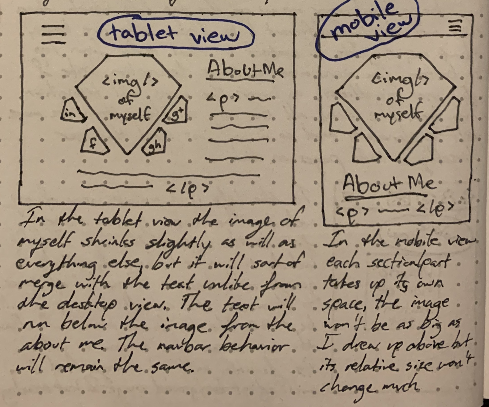
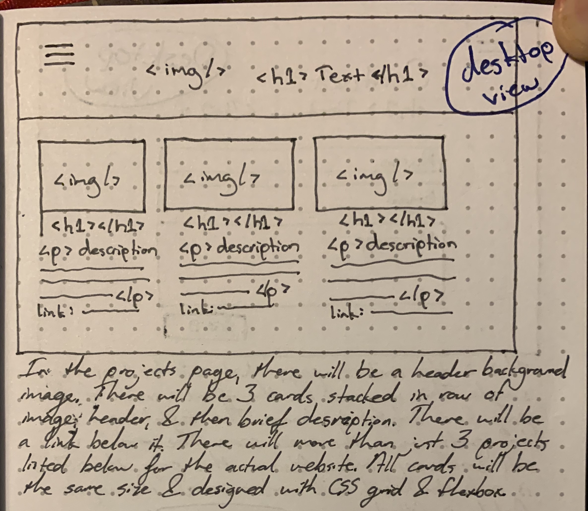
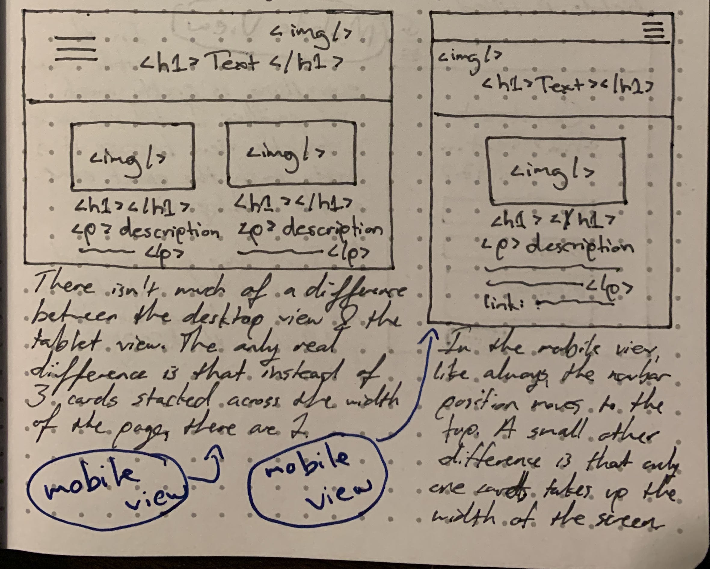
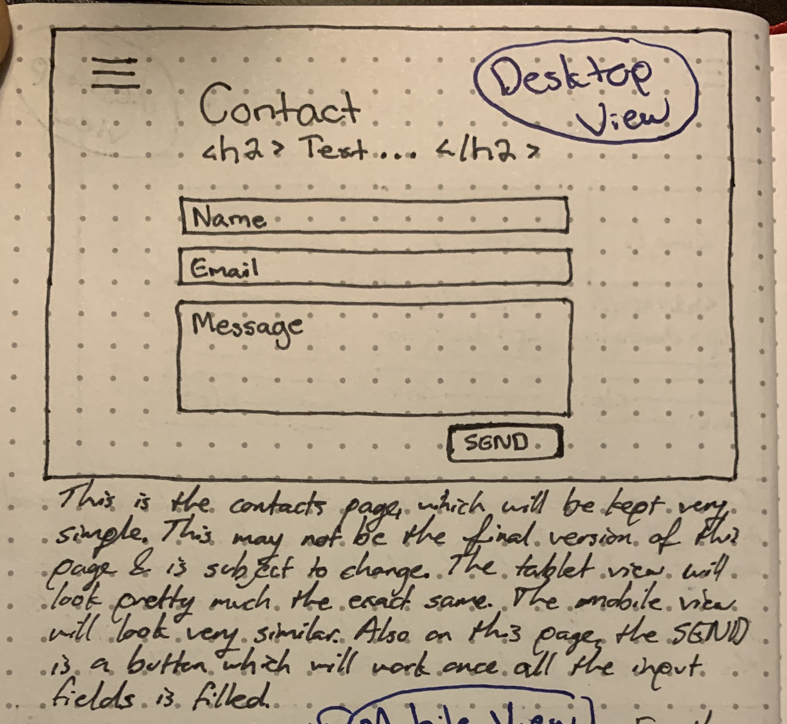
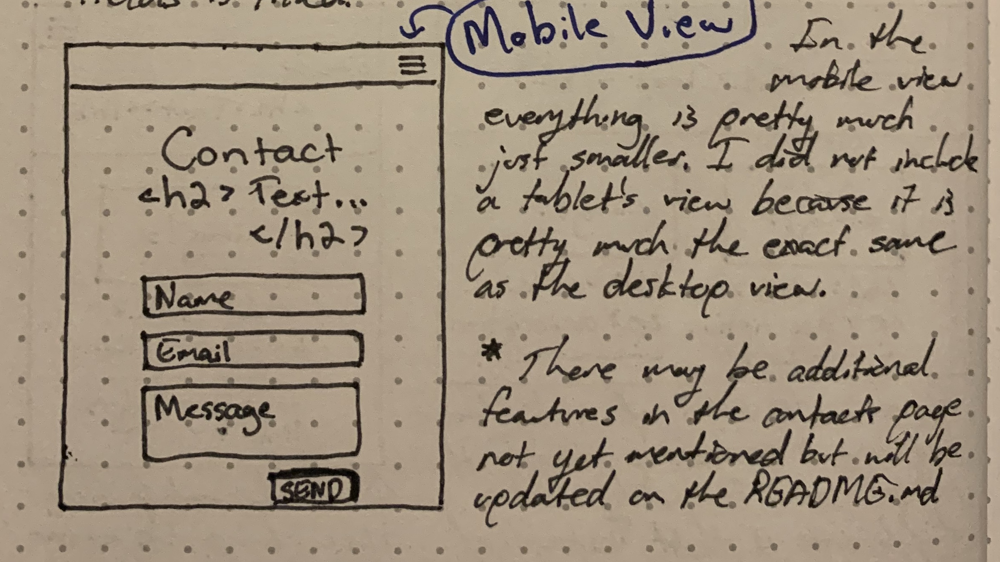

# My Portfolio
A personal website to present myself as a Full Stack Engineer by showcasing my projects and myself.

## About the App
This app will have multiple pages to show a description of each part of the website. Description that includes, my projects, a summary of who I am, and my contact info.

This will be a dynamic app so it will be presentable from a mobile view to a desktop view. And it can be accessed via link of deployment below.

## Wireframes
### First Page of Wireframe
Desktop Version of Landing Page             |  Description
:--------------------------:|:-------------------------:
   |  The desktop version of the landing page shows the navbar after the hamburger menu has been clicked. And also an overall gist of how the landing page is going to look like which is an image background and some center text. The wireframe for this page will not include a tablet view because it will look exactly the same as the desktop view except it may be scaled to a bit smaller size.

Mobile Version of Landing Page             |  Description
:--------------------------:|:-------------------------:
   |  The mobile version of the landing page shows the change in location of the navbar. This also displays the navbar after the hamburger menu has been clicked. Everything else is relatively the same but scaled to mobile size.

------------------------------------------------------------------------------------------------------------------------

### Second Page of Wireframe
Desktop Version of About Me Page             |  Description
:--------------------------:|:-------------------------:
   |  The desktop version of the about me page does not reveal the navbar but does show the hamburger menu which suggests that when clicked, will show the navbar. 

Mobile Version of About Me Page             |  Description
:--------------------------:|:-------------------------:
   |  This picture shows both the tablet view and mobile view of the webpage. The reason for that is because there is noticeable differences between all three sizes.

------------------------------------------------------------------------------------------------------------------------

### Third Page of Wireframe
Desktop Version of Projects Page             |  Description
:--------------------------:|:-------------------------:
   |  The desktop version of the project page only shows 3 projects showing it's image, header, description, and link. There will be more than 3 projects in the actual page when it is created but for the sake of simplicity and space, I only showed 3 as a means of an example.

Mobile Version of Projects Page             |  Description
:--------------------------:|:-------------------------:
   |  This picture also shows both the tablet view and mobile view of the webpage. All three views pretty much looks the same except that from desktop view to mobile view, since the width of the screen will be smaller, there will be less columns of projects and it will go down from 3 > 2 > 1. 

------------------------------------------------------------------------------------------------------------------------

### Fourth Page of Wireframe
Desktop Version of Contact Page             |  Description
:--------------------------:|:-------------------------:
   |  The desktop version of the contact page is kept very simple. It may change so this is not the final version and if it does change, an update section will be added including changes that has been made here as well as elsewhere.

Mobile Version of Contact Page             |  Description
:--------------------------:|:-------------------------:
   |  This is the mobile version of the contact page and just like with the landing page, this does not include the tablet view. The tablet view pretty much looks the same as the desktop view so for that reason, it wasn't added.

### Technologies Used
React, JavaScript, HTML5, CSS3

## Deployment
This website is available at: (WILL POST ONCE COMPLETED)